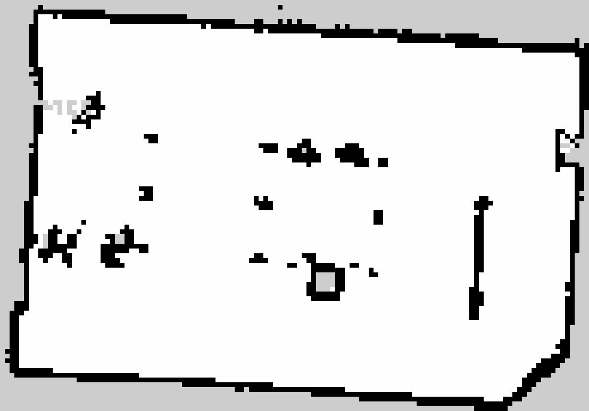
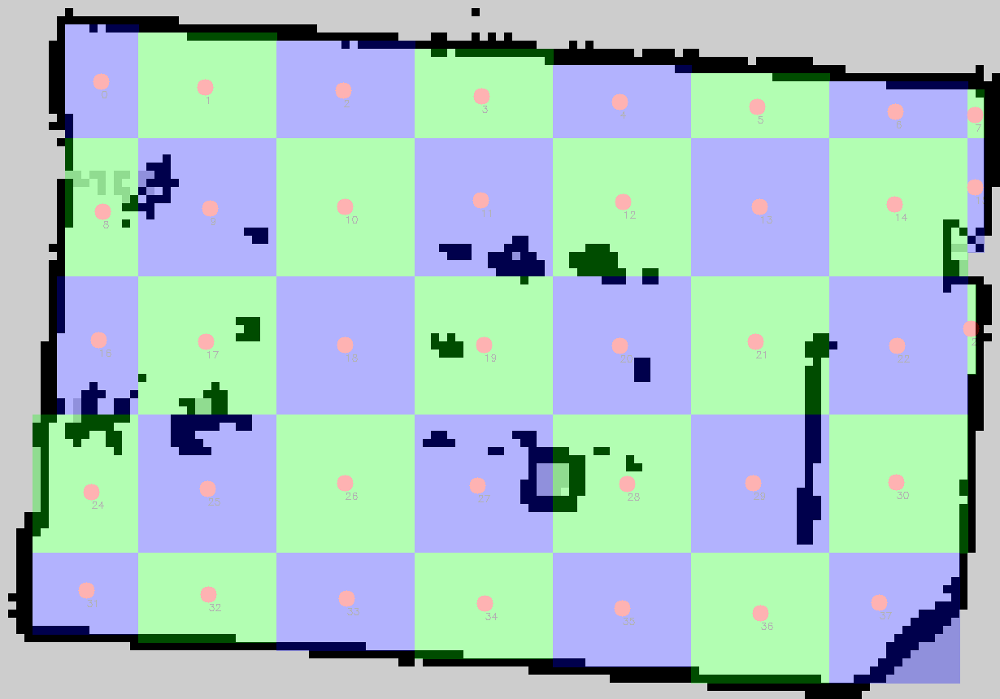
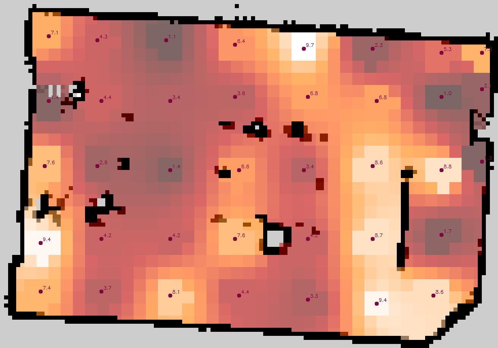
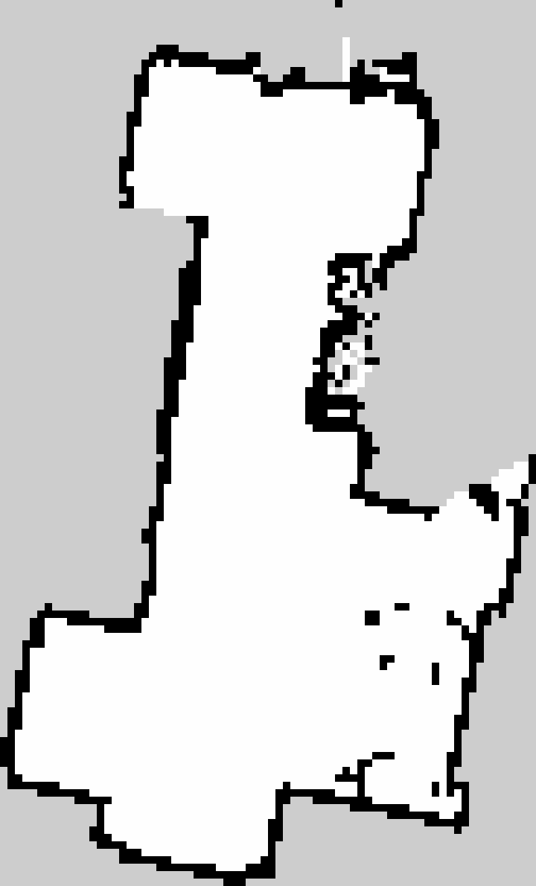
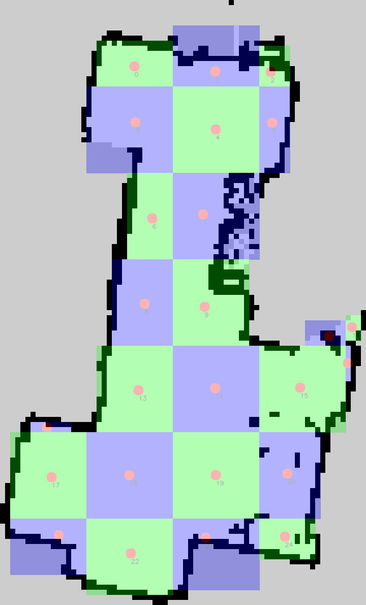
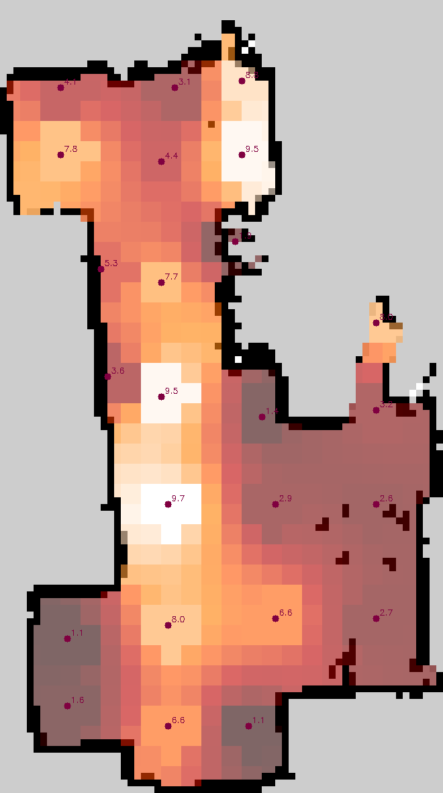

# Map Tools: Zone Partitioning, Waypoint Generation, and Heatmap Visualization

Welcome to **Map Tools**, your friendly Python toolkit designed to:

- Break down ROS2 2D maps into manageable free-space zones
- Turn those zones into plug and play waypoints for ROS2 navigation stack
- Plug in real or simulated measurements with zero hassle
- Transform raw data into beautiful heatmaps overlaying your map


All you need is the .pgm and .yaml export of the 2D map generated by any SLAM system. 

We built this to make environmental mapping easy for visualising EMF power radiated in air. Whether you’re running a robot through industrial environments or in a lab and want to visualize anything from EMF power to temperature or humidity, it will work. We use this tool ourselves as a post-processor for a waypoint-based autonomous navigation algorithm (coming soon in another repository) and for generating daily EMF diffusion reports that are automatically emailed as part of our monitoring workflow.

---
### Meeting room

| Raw Map | Zone Overlay | Heatmap |
|:-------:|:------------:|:-------:|
|  |  |  |

### Floor kitchen

| Raw Map | Zone Overlay | Heatmap |
|:-------:|:------------:|:-------:|
|  |  |  |

---
### There is also a method for generating elevation heatmap as a .svg


## What’s Inside?
Once your environment map is loaded, Map Tools gets to work by breaking it down into clean, navigable zones based on free-space detection. Each zone’s center point becomes a waypoint, helping with precise and autonomous robot navigation. After zones are ready, there are injected real-world measurements or simulated values like EMF readings, temperatures, or any custom data into each zone. The system intelligently diffuses the measurements across nearby zones using an iterative neighbor-averaging technique, smoothing out the map naturally, similar to how heat spreads through a surface. Finally, all the processed data is beautifully visualized on the original map, giving you an intuitive heatmap that tells a complete story of your environment at a glance.

```text
map_tools/
├── main.py                 # Run zones or heatmap workflows
├── utils.py                # Utility functions & Measurements class
├── yaml_files/             # All your YAML configs and results
│   ├── config.yaml         # Tweak paths, scales, thresholds here
│   ├── zones_waypoints.yaml# Waypoints list for navigation
│   └── measurements.yaml   # Populated after measurements
├── native_maps/            # Raw map + zones overlay (1× scale)
└── scaled_maps/            # Upscaled visuals + heatmaps
```

---

## Getting Started

1. **Install dependencies**:
   ```bash
   pip install pyyaml Pillow opencv-python numpy matplotlib
   ```
2. **Configure** `yaml_files/config.yaml` with your map paths and preferences.
3. **Run** zone creation:
   ```bash
   python3 main.py --output zones
   ```
4. **Measure** (random by default):
   ```bash
   python3 main.py --output heatmap --values absent
   ```
5. **Visualize** your results in `scaled_maps/heatmap.png`.

---

## How It Works

1. **Map Conversion**: Converts PGM maps to PNG, both native and upscaled for clarity.
2. **Zone Generation**: Slices the map into blocks, finds free-space areas, and calculates centroids.
3. **Waypoint Export**: Saves a sorted list of waypoints (`zones_waypoints.yaml`) ready for ROS2 navigation.
4. **Measurement Plug-In**: Our `Measurements` class lets you drop in any function to fetch real sensor data—or use the built-in random generator for quick demos.
5. **Heatmap Creation**: Diffuses your measurements across all zones, applies a color map, and blends it back onto the original map.

---

## Customize Your Measurements

Need real data? Simply:

```python
from utils import Measurements

def read_my_sensor(zone_id):
    # Fetch real-world EMF or other environmental data
    return my_sensor_api.get_value(zone_id)

meas = Measurements(
    zones_yaml_path='yaml_files/zones_waypoints.yaml',
    heatmap_yaml_path='yaml_files/measurements.yaml',
    measurement_fn=read_my_sensor
)
meas.measure_all()
meas.save_measurements_yaml()
```

Or subclass `Measurements` and override `measure_zone()`—your choice.

---

## License

Apache 2.0 © Ciprian Dumitrache & Andreea Stratulat

